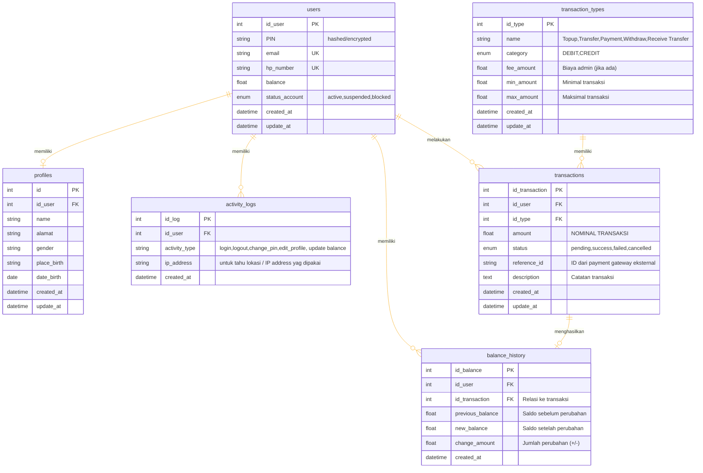

# ERD sisteem E-wallet

## Berikut merupakan ERD untuk sistem E-wallet menggunakan mermaid

```mermaid

---
config:
    theme: 'default'
    themeVariables:
        lineColor: '#F8B229'
---
erDiagram
    users {
        int id_user PK
        string PIN "hashed/encrypted"
        string email UK
        string hp_number UK
        float balance
        enum status_account "active,suspended,blocked"
        datetime created_at
        datetime update_at
    }
    profiles {
        int id PK
        int id_user FK
        string name
        string alamat
        string gender
        string place_birth
        date date_birth
        datetime created_at
        datetime update_at
    }

    activity_logs {
        int id_log PK
        int id_user FK
        string activity_type "login,logout,change_pin,edit_profile, update balance"
        string ip_address "untuk tahu lokasi / IP address yag dipakai"
        datetime created_at
    }

    transactions {
        int id_transaction PK
        int id_user FK
        int id_type FK
        float amount "NOMINAL TRANSAKSI"
        enum status "pending,success,failed,cancelled"
        string reference_id "ID dari payment gateway eksternal"
        text description "Catatan transaksi"
        datetime created_at
        datetime update_at
    }

    transaction_types {
        int id_type PK
        string name "Topup,Transfer,Payment,Withdraw,Receive Transfer"
        enum category "DEBIT,CREDIT"
        float fee_amount "Biaya admin (jika ada)"
        float min_amount "Minimal transaksi"
        float max_amount "Maksimal transaksi"
        datetime created_at
        datetime update_at
    }

    balance_history {
        int id_balance PK
        int id_user FK
        int id_transaction FK "Relasi ke transaksi"
        float previous_balance "Saldo sebelum perubahan"
        float new_balance "Saldo setelah perubahan"
        float change_amount "Jumlah perubahan (+/-)"
        datetime created_at
    }

    %% RELASI
    users ||--o| profiles : "memiliki"
    users ||--o{ transactions : "melakukan"
    users ||--o{ activity_logs : "memiliki"
    users ||--o{ balance_history : "memiliki"
    transaction_types ||--o{ transactions : "memiliki"
    transactions ||--o| balance_history : "menghasilkan"

```